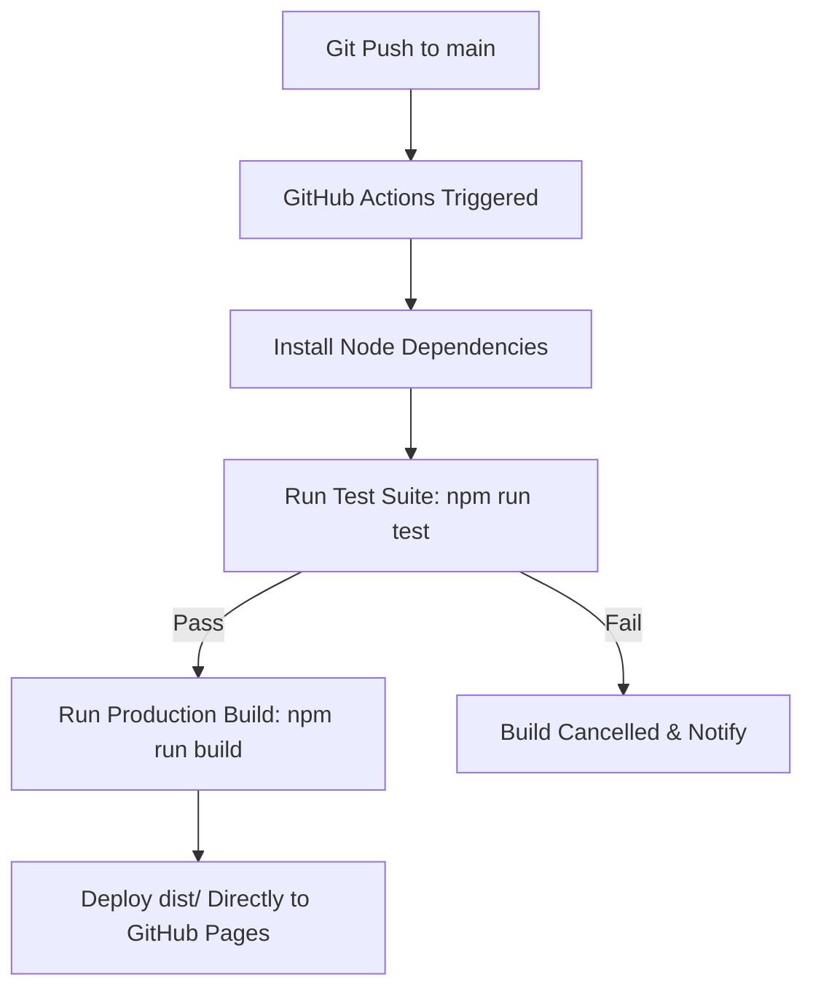

# BothaHome - Family Portal & Resume

This repository contains the source code for the personal portfolio and online resume of the **Botha Family**, hosted at [www.bothahome.co.za](https://www.bothahome.co.za) and served via GitHub Pages.

---

## 📂 Repository Structure

The codebase is structured to separate source files, automated tests, build tools, and configuration assets:

```
├── .github/workflows/
│   └── deploy.yml       # GitHub Actions CI/CD deployment workflow
├── src/                 # Website source files (served in development)
│   ├── assets/
│   │   ├── css/         # Modular CSS files (home.css, small.css, etc.)
│   │   └── images/      # High-resolution original images and WebP alternates
│   ├── logo/            # Branding icons and logo SVG assets
│   ├── CNAME            # GitHub Pages custom domain configuration
│   ├── index.html       # Landing page (Main resume hub)
│   ├── privacy-policy.html
│   └── terms-of-service.html
├── tests/
│   └── website.test.js  # Automated HTML, Asset, and SEO test suite (Vitest)
├── build.js             # Node.js production compiler and asset optimizer
├── package.json         # Development dependencies and npm scripts
└── README.md            # This documentation
```

---

## 🛠️ Local Development & Operations

### 📋 Prerequisites
- **Node.js**: Version `18` or higher is required.
- **npm**: Version `9` or higher.

### 📥 1. Installation
Install the project development dependencies (like JSDOM, Vitest, clean-css, and sharp):
```bash
npm install
```

### 🚀 2. Running the Development Server
To preview the website locally with live-reloading (changes reload in the browser instantly upon saving):
```bash
npm run dev
```
Once started, the site will be available at:
- **Local URL**: [http://localhost:3000](http://localhost:3000)

> Note: The dev server (`http-server`) is a static file server. For live-reload during development, manually refresh the browser after making changes. This service was swapped from `lite-server` to eliminate a deep dependency chain with 20+ high-severity vulnerabilities in `axios`.

### 🧪 3. Running Automated Tests
We use **Vitest** and **JSDOM** to verify site standards and asset integrity before deployment.
To execute the test suite:
```bash
npm run test
```
The test suite validates:
- **Standard compliance**: Valid metadata tags (charset, viewport) and SEO headers.
- **Asset integrity**: Ensures all images (`` and `<picture>` elements) and favicon resources referenced in the HTML actually exist on disk in the `src/` folder.
- **Link validity**: Verifies all links are properly structured.

### 📦 4. Building for Production
To compile and optimize the site locally:
```bash
npm run build
```
This runs the [build.js](build.js) compiler script, which:
1. Re-creates a clean `dist/` directory.
2. Minifies all CSS stylesheets in `src/assets/css/` to optimize load times.
3. Automatically generates WebP versions of any new JPEG/PNG images using `sharp`.
4. Copies all HTML pages, dynamic logo assets, and your `CNAME` domain configuration.
5. Ignores the compiled `dist/` directory locally to keep the git history clean.

---

## 🚀 CI/CD Deployment Pipeline

This website features a modern continuous deployment workflow via GitHub Actions configured in [deploy.yml](.github/workflows/deploy.yml):



### Key Benefits:
- **Test-Driven Deployments**: If any test fails (such as a broken image link or missing stylesheet), the build will automatically fail and prevent broken deployments.
- **No Git Clutter**: Build artifacts, resized WebP images, and minified CSS are generated on-the-fly in the CI runner and deployed directly. Optimized files are never checked back into Git, eliminating merge conflicts and keeping the repository history clean.
- **GPG Signing**: All pushes to `main` must be GPG signed to ensure authenticity and integrity.

---

## 🌐 Custom Domain Setup
The custom domain `bothahome.co.za` is configured inside [src/CNAME](src/CNAME). During the build process, the [build.js](build.js) script copies it to the root of the `dist/` directory. When GitHub Actions deploys the build artifact, GitHub Pages reads `dist/CNAME` and correctly maps the domain.
